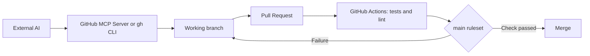

# Integrating Other AIs with GitHub

[Português](README.md) | [English](README.en.md)

A guide to integrating external AI agents with GitHub through a secure workflow
of branches, pull requests, tests, and review. Its purpose is to let tools such
as Claude Code, Codex, Gemini CLI, Cursor, and Aider contribute to projects
without relying exclusively on GitHub Copilot.

## Integration boundaries

Other AIs can operate a repository with nearly the same operational autonomy as
Copilot, but they do not automatically receive GitHub Copilot's native
interface. Integration is achieved through GitHub tools and protocols:

- GitHub MCP Server;
- GitHub CLI (`gh`);
- GitHub Apps or access tokens;
- GitHub Actions;
- GitHub webhooks and APIs.

## Recommended architecture



1. Run the external AI locally or in a controlled environment.
2. Connect it to GitHub through MCP or `gh`, with credentials limited to the
   required repository.
3. Have the AI create a branch and submit changes through a pull request.
4. Run tests, lint, and security checks in GitHub Actions.
5. Protect `main` with rulesets that require PRs and passing checks.

## Local MCP integration

The [GitHub MCP Server](https://github.com/github/github-mcp-server) exposes
tools that let MCP-compatible clients query repositories, issues, pull
requests, workflows, and files. Configure the AI client with GitHub's MCP
server and grant only the permissions it needs.

An attached AI can, for example:

- analyze code and files;
- create issues and pull requests;
- comment on or review changes;
- inspect workflow runs;
- update documentation;
- commit to an authorized branch.

## GitHub CLI integration

Any AI capable of executing local commands can use GitHub CLI:

```bash
gh auth login
gh repo clone OWNER/REPOSITORY
git switch -c feat/my-change
# The AI changes files and runs tests.
git add .
git commit -m "Describe the change"
git push -u origin feat/my-change
gh pr create --base main --fill
```

Prefer least-privilege tokens with access only to the required repositories.
Revoke tokens that are no longer used.

## Remote automation with GitHub Actions

A workflow can call an AI API for well-bounded tasks such as issue triage,
draft generation, or pull-request analysis. Store provider keys in **GitHub
Secrets**, never in versioned files.

For workflows triggered by pull requests from forks:

- use read-only permissions by default;
- never expose secrets to untrusted code;
- do not run AI commands with write permission without review;
- validate inputs from issues, comments, and PR descriptions.

## Recommended protection rules

To protect the primary branch:

- block deletion and force pushes;
- require a pull request before merge;
- require passing tests and lint;
- require human approval when a team is involved;
- enable linear history if the team adopts squash or rebase merging;
- limit write permissions for bots and workflows.

For a single maintainer, a practical configuration is to require PRs and
passing checks with zero required approvals. This lets the maintainer merge
their own PR only after CI is green.

## Operational security

- Never commit tokens, API keys, or `.env` files.
- Do not give an AI administrative access unless it is necessary.
- Use disposable branches for experimental changes.
- Review diffs before merge even when CI is green.
- Record authorship and automation in commit messages and PRs.
- Review third-party actions and pin versions by SHA when the risk warrants it.

## Resources

- [GitHub MCP Server](https://github.com/github/github-mcp-server)
- [GitHub CLI](https://cli.github.com/)
- [GitHub Apps](https://docs.github.com/apps)
- [GitHub Actions](https://docs.github.com/actions)
- [Rulesets](https://docs.github.com/repositories/configuring-branches-and-merges-in-your-repository/managing-rulesets)

## Examples by AI client

Executable examples and client configurations are available under
[`examples/`](examples/README.md):

- [`claude-code/`](examples/claude-code/README.md)
- [`codex/`](examples/codex/README.md)
- [`gemini-cli/`](examples/gemini-cli/README.md)
- [`cursor/`](examples/cursor/README.md)
- [`aider/`](examples/aider/README.md)

## Repository structure

```text
GitHub_Integration_Other_IAs/
├── LICENSE                                      # Full Apache-2.0 license text.
├── README.md                                    # Primary guide in Portuguese.
├── README.en.md                                 # Primary guide in English.
│
└── examples/
    ├── README.md                                # Shared conventions and MCP support matrix.
    ├── shared/
    │   └── scripts/
    │       └── New-SafePullRequest.ps1          # Shared helper: creates a safe branch and guides PR creation.
    │
    ├── claude-code/
    │   ├── README.md                            # Claude Code usage instructions.
    │   ├── config/
    │   │   ├── mcp-stdio.json                   # Docker/stdio GitHub MCP Server template.
    │   │   └── mcp-remote.json                  # Remote HTTP template with local token placeholder.
    │   ├── scripts/
    │   │   └── new-safe-pr.ps1                  # Claude Code wrapper for the shared PR helper.
    │   └── src/
    │       └── agent-instructions.md            # Claude Code safety and workflow prompt.
    │
    ├── codex/
    │   ├── README.md                            # Codex configuration instructions.
    │   ├── config/
    │   │   ├── mcp-stdio.config.toml            # Docker/stdio configuration for ~/.codex/config.toml.
    │   │   └── mcp-remote.config.toml           # Remote HTTP configuration using GITHUB_PAT_TOKEN.
    │   ├── scripts/
    │   │   └── new-safe-pr.ps1                  # Codex wrapper for the shared PR helper.
    │   └── src/
    │       └── agent-instructions.md            # Codex safety and workflow prompt.
    │
    ├── gemini-cli/
    │   ├── README.md                            # Gemini CLI configuration instructions.
    │   ├── config/
    │   │   ├── mcp-stdio.settings.json          # Docker/stdio template for Gemini settings.json.
    │   │   └── mcp-remote.settings.json         # Remote HTTP template using the httpUrl property.
    │   ├── scripts/
    │   │   └── new-safe-pr.ps1                  # Gemini CLI wrapper for the shared PR helper.
    │   └── src/
    │       └── agent-instructions.md            # Gemini CLI safety and workflow prompt.
    │
    ├── cursor/
    │   ├── README.md                            # Cursor configuration instructions.
    │   ├── config/
    │   │   ├── mcp-stdio.json                   # Docker/stdio template for .cursor/mcp.json.
    │   │   └── mcp-remote.json                  # Remote HTTP template with local token placeholder.
    │   ├── scripts/
    │   │   └── new-safe-pr.ps1                  # Cursor wrapper for the shared PR helper.
    │   └── src/
    │       └── agent-instructions.md            # Cursor safety and workflow prompt.
    │
    └── aider/
        ├── README.md                            # Aider CLI limitation and supported alternatives.
        ├── config/
        │   └── aiderdesk-mcp-stdio.template.json # Docker/stdio template for an MCP-capable AiderDesk client.
        ├── scripts/
        │   └── new-safe-pr.ps1                  # Aider wrapper for the shared PR helper.
        └── src/
            └── agent-instructions.md            # Aider instructions using the gh CLI alternative flow.
```

## License

Copyright (c) 2026 Aridio Silva. This material is distributed under the
[Apache License 2.0](LICENSE).
