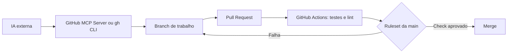

# Integrando Outras IAs ao GitHub

[Português](README.md) | [English](README.en.md)

Guia para integrar agentes de IA externos ao GitHub com um fluxo seguro de
branches, pull requests, testes e revisão. O objetivo é permitir que ferramentas
como Claude Code, Codex, Gemini CLI, Cursor e Aider contribuam para projetos
sem depender exclusivamente do GitHub Copilot.

## Limites da integração

Outras IAs podem operar um repositório quase com a mesma autonomia operacional
do Copilot, mas não recebem automaticamente a interface nativa do GitHub
Copilot. A integração é obtida por ferramentas e protocolos do GitHub:

- GitHub MCP Server;
- GitHub CLI (`gh`);
- GitHub Apps ou tokens de acesso;
- GitHub Actions;
- webhooks e APIs do GitHub.

## Arquitetura recomendada



1. Execute a IA externa localmente ou em um ambiente controlado.
2. Conecte a IA ao GitHub por MCP ou `gh`, com credenciais limitadas ao
   repositório necessário.
3. Faça a IA criar uma branch e enviar alterações por pull request.
4. Execute testes, lint e verificações de segurança no GitHub Actions.
5. Proteja a `main` com rulesets que exijam PR e checks aprovados.

## Integração local por MCP

O [GitHub MCP Server](https://github.com/github/github-mcp-server) fornece
ferramentas para que clientes compatíveis com MCP possam consultar repositórios,
issues, pull requests, workflows e arquivos. Configure o cliente de IA com o
servidor MCP do GitHub e conceda apenas as permissões necessárias.

Exemplos de tarefas que uma IA conectada pode realizar:

- analisar código e arquivos;
- criar issues e pull requests;
- comentar ou revisar alterações;
- consultar execuções de workflows;
- atualizar documentação;
- criar commits em uma branch autorizada.

## Integração por GitHub CLI

Qualquer IA que execute comandos locais pode operar o GitHub CLI:

```bash
gh auth login
gh repo clone OWNER/REPOSITORY
git switch -c feat/minha-alteracao
# A IA altera os arquivos e executa os testes.
git add .
git commit -m "Describe the change"
git push -u origin feat/minha-alteracao
gh pr create --base main --fill
```

Prefira tokens com escopo mínimo e acesso apenas aos repositórios necessários.
Revogue tokens que não forem mais usados.

## Automação remota com GitHub Actions

Uma workflow pode chamar uma API de IA para tarefas bem delimitadas, como
triagem de issues, geração de rascunhos ou análise de pull requests. Guarde
chaves do provedor em **GitHub Secrets**, nunca em arquivos versionados.

Para workflows acionadas por pull requests de forks:

- use permissões somente de leitura por padrão;
- não exponha secrets ao código não confiável;
- não execute comandos de IA com permissão de escrita sem revisão;
- valide entradas de issues, comentários e descrições de PR.

## Regras de proteção recomendadas

Para proteger a branch principal:

- bloqueie exclusão e *force push*;
- exija pull request antes do merge;
- exija testes e lint aprovados;
- exija aprovação humana quando houver equipe;
- habilite histórico linear se a equipe adotar *squash* ou *rebase merge*;
- restrinja permissões de escrita de bots e workflows.

Para um mantenedor único, uma configuração prática é exigir PR e checks
aprovados, com zero aprovações obrigatórias. Assim, o mantenedor pode integrar
a própria PR somente depois da CI ficar verde.

## Segurança operacional

- Nunca inclua tokens, chaves de API ou arquivos `.env` em commits.
- Não dê acesso administrativo a uma IA sem necessidade.
- Use branches descartáveis para mudanças experimentais.
- Analise o diff antes do merge, mesmo quando a CI estiver aprovada.
- Registre autoria e automatizações nas mensagens de commit e nas PRs.
- Revise actions de terceiros e fixe versões por SHA quando o risco exigir.

## Recursos

- [GitHub MCP Server](https://github.com/github/github-mcp-server)
- [GitHub CLI](https://cli.github.com/)
- [GitHub Apps](https://docs.github.com/apps)
- [GitHub Actions](https://docs.github.com/actions)
- [Rulesets](https://docs.github.com/repositories/configuring-branches-and-merges-in-your-repository/managing-rulesets)

## Exemplos por IA

Os exemplos executáveis e configurações de cliente ficam em
[`examples/`](examples/README.md):

- [`claude-code/`](examples/claude-code/README.md)
- [`codex/`](examples/codex/README.md)
- [`gemini-cli/`](examples/gemini-cli/README.md)
- [`cursor/`](examples/cursor/README.md)
- [`aider/`](examples/aider/README.md)

## Estrutura do repositório

```text
GitHub_Integration_Other_IAs/
├── LICENSE                                      # Texto integral da licença Apache-2.0.
├── README.md                                    # Guia principal em português.
├── README.en.md                                 # Guia principal em inglês.
│
└── examples/
    ├── README.md                                # Convenções comuns e matriz de suporte MCP.
    ├── shared/
    │   └── scripts/
    │       └── New-SafePullRequest.ps1          # Helper comum: cria branch segura e orienta a abertura de PR.
    │
    ├── claude-code/
    │   ├── README.md                            # Instruções de uso do Claude Code.
    │   ├── config/
    │   │   ├── mcp-stdio.json                   # Modelo Docker/stdio para o GitHub MCP Server.
    │   │   └── mcp-remote.json                  # Modelo HTTP remoto com marcador de token local.
    │   ├── scripts/
    │   │   └── new-safe-pr.ps1                  # Wrapper do helper de PR identificado como Claude Code.
    │   └── src/
    │       └── agent-instructions.md            # Prompt de segurança e fluxo de trabalho do Claude Code.
    │
    ├── codex/
    │   ├── README.md                            # Instruções de configuração do Codex.
    │   ├── config/
    │   │   ├── mcp-stdio.config.toml            # Configuração Docker/stdio para ~/.codex/config.toml.
    │   │   └── mcp-remote.config.toml           # Configuração HTTP usando GITHUB_PAT_TOKEN.
    │   ├── scripts/
    │   │   └── new-safe-pr.ps1                  # Wrapper do helper de PR identificado como Codex.
    │   └── src/
    │       └── agent-instructions.md            # Prompt de segurança e fluxo de trabalho do Codex.
    │
    ├── gemini-cli/
    │   ├── README.md                            # Instruções de configuração do Gemini CLI.
    │   ├── config/
    │   │   ├── mcp-stdio.settings.json          # Modelo Docker/stdio para settings.json do Gemini.
    │   │   └── mcp-remote.settings.json         # Modelo HTTP remoto com a propriedade httpUrl.
    │   ├── scripts/
    │   │   └── new-safe-pr.ps1                  # Wrapper do helper de PR identificado como Gemini CLI.
    │   └── src/
    │       └── agent-instructions.md            # Prompt de segurança e fluxo de trabalho do Gemini CLI.
    │
    ├── cursor/
    │   ├── README.md                            # Instruções de configuração do Cursor.
    │   ├── config/
    │   │   ├── mcp-stdio.json                   # Modelo Docker/stdio para .cursor/mcp.json.
    │   │   └── mcp-remote.json                  # Modelo HTTP remoto com marcador de token local.
    │   ├── scripts/
    │   │   └── new-safe-pr.ps1                  # Wrapper do helper de PR identificado como Cursor.
    │   └── src/
    │       └── agent-instructions.md            # Prompt de segurança e fluxo de trabalho do Cursor.
    │
    └── aider/
        ├── README.md                            # Limitação do Aider CLI e alternativas suportadas.
        ├── config/
        │   └── aiderdesk-mcp-stdio.template.json # Modelo Docker/stdio para cliente AiderDesk com MCP.
        ├── scripts/
        │   └── new-safe-pr.ps1                  # Wrapper do helper de PR identificado como Aider.
        └── src/
            └── agent-instructions.md            # Instruções para Aider com fluxo alternativo via gh CLI.
```

## Licença

Copyright (c) 2026 Aridio Silva. Este material é distribuído sob a
[Apache License 2.0](LICENSE).
